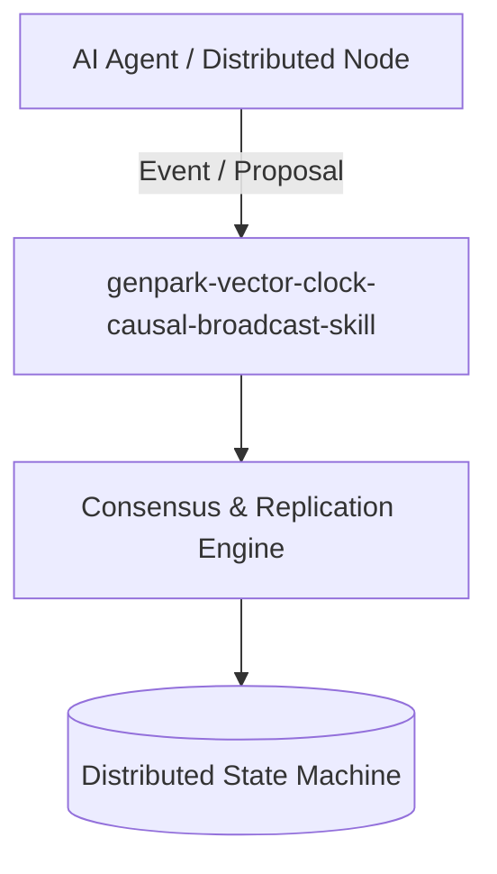

# genpark-vector-clock-causal-broadcast-skill

[](https://github.com/alphaparkinc/genpark-vector-clock-causal-broadcast-skill/actions)
[](https://opensource.org/licenses/MIT)
[](https://www.python.org/downloads/)

> Vector clock causality tracking and causal broadcast protocol providing Lamport partial ordering and causality violation detection for agent swarms.

## Architecture



## Features
- Pure standard library Python implementation with strictly zero pip dependencies.
- Mathematically provable distributed algorithms guaranteeing consistency and fault tolerance.
- Native Model Context Protocol (MCP) server support for multi-agent swarm synchronization.

## Installation

```bash
git clone https://github.com/alphaparkinc/genpark-vector-clock-causal-broadcast-skill.git
cd genpark-vector-clock-causal-broadcast-skill
```

## Quickstart

```bash
python example_usage.py
```
